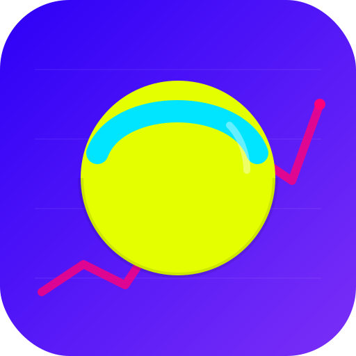
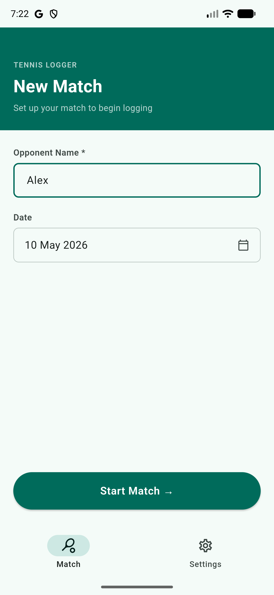
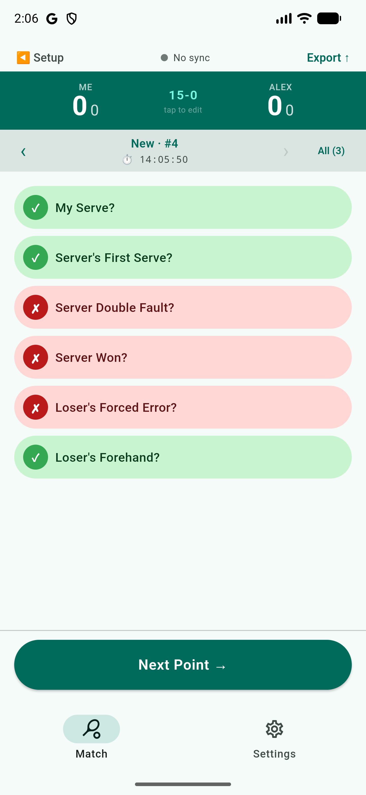
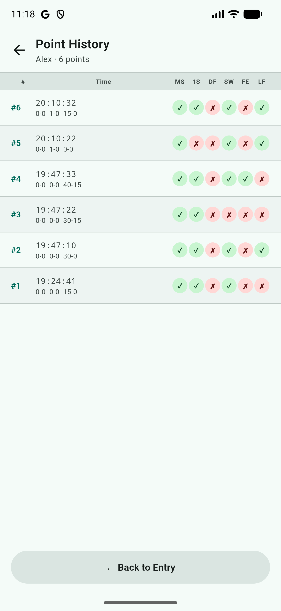
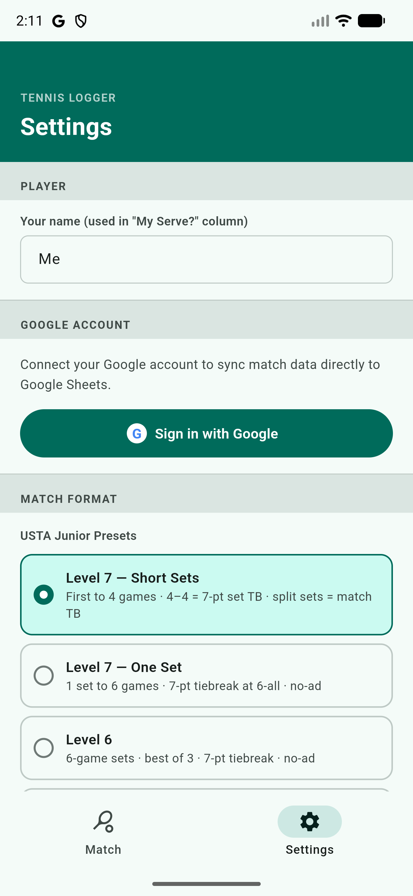

<p align="center">
  
</p>

<h1 align="center">Tennis Point Logger</h1>

<p align="center">
  <a href="https://github.com/markovarghese/tennis-point-logger/actions/workflows/build.yml">
    
  </a>
  <a href="https://github.com/markovarghese/tennis-point-logger/actions/workflows/codeql.yml">
    
  </a>
  <a href="https://github.com/markovarghese/tennis-point-logger/releases/latest">
    
  </a>
</p>

<p align="center">A mobile app for rapid point-by-point tennis match data entry, built with Flutter and Material You (Material Design 3).</p>

## Screenshots

<p align="center">
  
  
  
  
</p>

## What it does

Tennis Point Logger is designed for players, parents, and coaches who want to capture detailed shot-by-shot statistics during a tennis match without slowing the match down. Each point is logged with six binary tags, the running score is computed automatically, and the data can be exported or synced to a Google Sheet for analysis.

**Per-point data captured**

For every point, you tap one chip per question (Yes / No / unknown):

- **My Serve?** — were you the server
- **First Serve?** — went in on the first try
- **Double Fault?** — point ended on a double fault
- **Won?** — server won the point
- **Loser's Forced Error?** — point ended in a forced error
- **Loser's Forehand?** — final shot was off the loser's forehand

**Features**

- **Format-aware scoring engine** — sets, games, deuce/no-ad, configurable tiebreaks, and the USTA Junior presets (Levels 5/6/7 and Level 7 short sets)
- **Live score banner** — tracks sets, games, and points; detects tiebreaks and match end; tap to manually override the running score
- **History view** — review and edit any prior point; changes auto-save and propagate through the score engine
- **Match setup** — opponent name, match date, format preset
- **Export** — copy as CSV, save to device, or sync to Google Sheets (see below)
- **Google Sheets sync** — sign in with Google, pick a Drive folder for a new spreadsheet *or* an existing sheet, and choose your sync cadence (after every point, on match end, or offline-only)

## How to use

### 1. Before the match — Settings screen

1. Open the app and go to the **Settings** tab.
2. Tap **Sign in with Google** and authenticate with your Google account.
3. Choose where match data gets saved:
   - **New spreadsheet** — pick a Google Drive folder; the app creates a new Sheets doc for this match.
   - **Existing spreadsheet** — pick a Sheets doc previously created by this app; the next match's points get appended to the end of its `LoggerData` table.
4. Select the correct **USTA level** preset and adjust any format settings (number of sets, games per set, tiebreak rules) as needed.

### 2. Match setup — Match screen

1. Switch to the **Match** tab.
2. Enter your **opponent's name**.
3. Tap **Start Match**.

### 3. During the match — logging each point

For every point played, set the following toggles **before** tapping **Next Point**:

| Toggle | When to set |
|---|---|
| **My Serve?** | On if you are serving; off if your opponent is serving |
| **Server's First Serve?** | Leave on (default). Turn **off** if the server faulted on the first serve |
| **Server Won?** | On if the server won the point; off if the returner won |
| **Server Double Fault?** | On if the point ended on a double fault (also set **Server Won?** to off) |
| **Loser's Forced Error?** | On if the winner forced the loser into the error; off if the loser erred unforced |
| **Loser's Forehand?** | On if the loser's last shot was a forehand; off if it was a backhand |

Once all toggles reflect what happened on the court, tap **Next Point** to save the point and advance.

### 4. Correcting a point

Tap the **<** button to step back to the previous point and edit it. All changes propagate through the score engine immediately.

### 5. Correcting the score after a break

If you paused point-taking and the in-app score drifted from the real score, tap the **score panel** at the top of the Match screen to manually set the current score.

## Project layout

```
.
├── android/              # Android native project
├── integration_test/     # E2E integration tests (patrol + UIAutomator2)
│   ├── e2e_match_flow_test.dart
│   └── helpers/
│       └── sheets_verifier.dart
├── lib/
│   ├── main.dart         # App shell + navigation
│   ├── theme.dart        # Material You color tokens
│   ├── models/           # TennisPoint, MatchFormat, AppSettings
│   ├── services/         # Score engine, Google auth/Sheets
│   ├── screens/          # Setup, Entry, History, Settings
│   └── widgets/          # ScoreBanner, TriChip, ExportSheet, …
├── test/                 # Unit and widget tests
├── pubspec.yaml
└── .github/workflows/    # CI: analyze, test, build APK
```

## Prerequisites

| Tool | Version | Notes |
|---|---|---|
| **Flutter SDK** | 3.16+ (Dart 3.3+) | `flutter --version` to check |
| **Git** | any recent | for cloning |
| **Android Studio** *or* command-line Android SDK | with Android SDK 34+ and platform-tools | for Android builds |
| **Java JDK** | 17 | for the Android Gradle build |
| **Xcode** | 15+ | **iOS only** — required, only available on macOS |
| **CocoaPods** | latest | **iOS only** — `sudo gem install cocoapods` |
| A physical device or emulator | | Android emulator, iOS simulator, or USB-connected phone |

Verify your toolchain with:

```bash
flutter doctor
```

Resolve any red ✗ marks before proceeding (Flutter's output tells you exactly what's missing).

## Running locally

```bash
# 1. Clone the repo
git clone https://github.com/markovarghese/tennis-point-logger.git
cd tennis-point-logger

# 2. Fetch dependencies
flutter pub get

# 3. List connected devices / emulators
flutter devices

# 4. Run in debug mode on the first available device
flutter run

# Or target a specific device
flutter run -d <device-id>
```

Hot reload (`r`) and hot restart (`R`) work in the running terminal.

### Running tests and the analyzer

```bash
flutter analyze
flutter test
```

### Integration / E2E test

`integration_test/e2e_match_flow_test.dart` is a full end-to-end test that:

1. Launches the app on an Android emulator.
2. Signs in to a real Google account (handles the native Credential Manager sheet via UIAutomator2).
3. Creates a new spreadsheet in a specified Drive folder.
4. Starts a match, logs a point (you serve, you win).
5. Reads the Google Sheets doc and asserts the row was written correctly.
6. Navigates back to that point and edits it (you lose).
7. Re-reads the sheet and asserts the row was updated.

#### Prerequisites

| Requirement | Details |
|---|---|
| **patrol CLI** | A patched patrol CLI is required. See `integration_test/e2e_match_flow_test.dart` for the exact run command. |
| **Android emulator** | Pixel 7 Pro AVD recommended; API 34+ for Credential Manager |
| **Google account in the emulator** | Open the emulator → Settings → Accounts → Add Account → Google, and sign in to the test account once. patrol will tap that account in the native Credential Manager sheet during the test. |
| **Google Cloud credentials** | The app must already be registered in Google Cloud Console with your OAuth client ID wired up — follow the [Google sync setup](#google-sync-setup) section above. The test account must also be listed as a **Test user** on the OAuth consent screen while the app is unpublished. |
| **A `test_folder` in Google Drive** | The test account's Drive must contain a folder matching the name you pass in `TEST_FOLDER_NAME` (default: `test_folder`). The test will create a new spreadsheet inside it. |

#### Running the test

Boot your Pixel 7 Pro AVD, then run:

```bash
dart run "C:/Users/marko/patrol_cli_patched/bin/main.dart" test \
  -t integration_test/e2e_match_flow_test.dart \
  --device emulator-5554 \
  --dart-define=TEST_ACCOUNT_EMAIL=<your@gmail.com> \
  --dart-define=TEST_FOLDER_NAME=test_folder
```

| `--dart-define` | Description |
|---|---|
| `TEST_ACCOUNT_EMAIL` | The Gmail address to tap in the Credential Manager sheet. **Required.** |
| `TEST_FOLDER_NAME` | The Drive folder to create the spreadsheet in. Defaults to `test_folder`. |

> **Tip:** If patrol can't find the emulator automatically, first run `adb devices` to confirm the device ID and replace `emulator-5554` accordingly.

#### How the Google Sign-In step works

The `google_sign_in` package (v7+) uses Android's Credential Manager API, which opens a **native** bottom sheet outside the Flutter widget tree. patrol bridges this gap by running UIAutomator2 alongside the Flutter test, locating the account row by its text (your email), and tapping it. A "Continue" confirmation tap is also attempted in case Android shows one.

This is the only step that relies on native automation — every other interaction (chip taps, navigation, sheet verification) runs in pure Dart via the `integration_test` package.

## Deploying to Android

The repo already contains a working `android/` project.

### 0. Sideload a pre-built APK (quickest — no build required)

Every release publishes a signed APK to [GitHub Releases](https://github.com/markovarghese/tennis-point-logger/releases). To install it on an Android phone:

1. On the phone, go to **Settings → Apps → Special app access → Install unknown apps** and allow your browser or file manager.
2. Download the latest `tennis-point-logger-vX.Y.Z.apk` from the [Releases page](https://github.com/markovarghese/tennis-point-logger/releases) directly on the phone (or transfer it from your computer via USB / AirDrop).
3. Tap the downloaded file and follow the install prompt.

> **Tip:** You can also paste the direct download URL into the phone's browser — look for the `.apk` asset under the latest release.

### 1. Debug install (development)

Connect a phone with USB debugging enabled (or boot an emulator) and run:

```bash
flutter run --release   # full-speed build, still installable from your machine
```

### 2. Release APK (sideload / share an installable file)

```bash
flutter build apk --release
# Output: build/app/outputs/flutter-apk/app-release.apk
```

Transfer the `.apk` to a phone and install it (the user must enable "Install unknown apps" for the source).

### 3. Release App Bundle (Google Play)

```bash
flutter build appbundle --release
# Output: build/app/outputs/bundle/release/app-release.aab
```

Before publishing to Google Play, you need to **sign** the build:

1. Generate an upload keystore:
   ```bash
   keytool -genkey -v -keystore upload-keystore.jks -keyalg RSA \
     -keysize 2048 -validity 10000 -alias upload
   ```
2. Create `android/key.properties` (do **not** commit this file):
   ```properties
   storePassword=<password>
   keyPassword=<password>
   keyAlias=upload
   storeFile=/absolute/path/to/upload-keystore.jks
   ```
3. Wire the signing config into `android/app/build.gradle` per the [Flutter signing docs](https://docs.flutter.dev/deployment/android#signing-the-app).
4. Re-run `flutter build appbundle --release`.
5. Upload the `.aab` via the [Google Play Console](https://play.google.com/console) → create the app, fill in store listing, attach the bundle to an Internal/Closed/Open testing track, then promote to Production.

### CI builds

`.github/workflows/build.yml` runs `flutter analyze` and `flutter test` on every push to `main` and on pull requests. An optional iOS build can be triggered manually from the Actions tab.

## Releases

Releases are published automatically when a version tag is pushed. The release workflow builds the APK, attaches it to a GitHub Release, and generates release notes from commits since the previous tag.

### Publishing a release

1. Bump the version in `pubspec.yaml` — the version before the `+` is the public version, the number after is the build number:
   ```yaml
   version: 1.1.0+2
   ```
2. Commit and push to `main`:
   ```bash
   git add pubspec.yaml
   git commit -m "chore: bump version to 1.1.0"
   git push origin main
   ```
3. Tag the commit and push the tag:
   ```bash
   git tag v1.1.0
   git push origin v1.1.0
   ```

The tag must match the version in `pubspec.yaml` (e.g. tag `v1.1.0` → `version: 1.1.0+N`). The workflow enforces this and will fail early if they don't match.

The published APK appears under [Releases](https://github.com/markovarghese/tennis-point-logger/releases) and can be sideloaded directly onto an Android device.

## Deploying to iPhone

> **macOS required.** iOS builds cannot be produced on Windows or Linux — Xcode is Apple-only.

The repo currently does **not** include an `ios/` folder. You'll generate it once with the Flutter CLI.

### 1. Generate the iOS project (one-time)

From a Mac, in the repo root:

```bash
flutter create --platforms=ios --org com.example .
flutter pub get
cd ios && pod install && cd ..
```

Replace `com.example` with your reverse-DNS bundle identifier (e.g. `com.yourname.tennislogger`). Commit the new `ios/` folder.

### 2. Run on a simulator

```bash
open -a Simulator              # boot the iOS simulator
flutter run -d "iPhone 15"     # or whatever device shows in `flutter devices`
```

### 3. Run on a physical iPhone

1. Connect the iPhone via USB and trust the computer.
2. Open `ios/Runner.xcworkspace` in Xcode.
3. Select the **Runner** target → **Signing & Capabilities** → set your Apple Developer **Team** (a free Apple ID works for personal-device installs but expires after 7 days; a paid $99/yr Apple Developer account is required for App Store distribution and longer-lived provisioning).
4. Pick your iPhone in the device dropdown and press ▶︎ in Xcode, **or** run:
   ```bash
   flutter run --release -d <iphone-device-id>
   ```

### 4. Release build for TestFlight / App Store

1. **Apple Developer Program membership** ($99/yr) at [developer.apple.com](https://developer.apple.com).
2. In [App Store Connect](https://appstoreconnect.apple.com), create the app record (bundle ID, name, SKU).
3. Build the release archive:
   ```bash
   flutter build ipa --release
   # Output: build/ios/ipa/<your-app>.ipa
   ```
4. Upload via Xcode (`Window → Organizer → Distribute App`) or with `xcrun altool` / Transporter.
5. Once processed, the build appears in App Store Connect → assign it to a **TestFlight** group for beta testers, or submit it for App Store review.

Apple's full guide: <https://docs.flutter.dev/deployment/ios>.

## Google sync setup

Google Sign-In and Sheets sync are fully implemented in the code. Before they will work you need to register the app in **Google Cloud Console** and create OAuth credentials. Do this once per development environment (the debug SHA-1 is machine-specific).

### 1. Create a Google Cloud project

1. Go to [console.cloud.google.com](https://console.cloud.google.com) → **New Project** → name it (e.g. `tennis-point-logger`) → **Create**.
2. With the project selected, go to **APIs & Services → Library** and enable:
   - **Google Drive API**
   - **Google Sheets API**

### 2. Configure the OAuth consent screen

1. Go to **APIs & Services → OAuth consent screen** (new UI: **Google Auth Platform → Overview**).
2. Click **Get started** (or **Create**), choose **External**, fill in an app name and your email, and complete the wizard.
3. Under **Test users**, add every Gmail address you want to test with while the app is in development.

### 3. Get your debug SHA-1

```bash
keytool -list -v \
  -keystore ~/.android/debug.keystore \
  -alias androiddebugkey \
  -storepass android -keypass android
```

Copy the `SHA1:` value. You'll need a new one for each machine you develop on, and a different one for a release keystore when publishing.

### 4. Create OAuth client IDs

Go to **APIs & Services → Credentials** (new UI: **Google Auth Platform → Clients**) → **+ Create Client**.

**Android client** (required to trust the installed app):
- Application type: **Android**
- Package name: `com.markovarghese.tennispointlogger`
- SHA-1: paste the value from step 3
- → **Create**

**Web client** (used by the Flutter SDK to obtain ID tokens):
- Application type: **Web application**
- → **Create**
- Copy the **Client ID** — it ends in `.apps.googleusercontent.com`

### 5. Set the Web client ID in the code

Open [`lib/services/google_auth_service.dart`](lib/services/google_auth_service.dart) and replace the `_webClientId` constant with your Web client ID:

```dart
static const _webClientId = '<YOUR_WEB_CLIENT_ID>.apps.googleusercontent.com';
```

### Notes

- The `google_sign_in` Flutter package uses the Web client ID directly — you do **not** need `google-services.json` for Sign-In or Sheets sync.
- **Firebase Crashlytics** (also wired up in this project) *does* require a `google-services.json`. Obtain it from [Firebase Console](https://console.firebase.google.com) → your project → Project settings → Android app → Download `google-services.json`, then place it at `android/app/google-services.json`. This file is gitignored and must be added manually on each machine.
- For a **release build** (Play Store), repeat step 3 with your upload/release keystore and create a second Android OAuth client for that SHA-1.
- iOS support requires a separate iOS OAuth client (bundle ID only, no SHA-1) and a `GoogleService-Info.plist` — see the [google_sign_in iOS setup guide](https://pub.dev/packages/google_sign_in#ios-integration).

## License

See [LICENSE](LICENSE).
